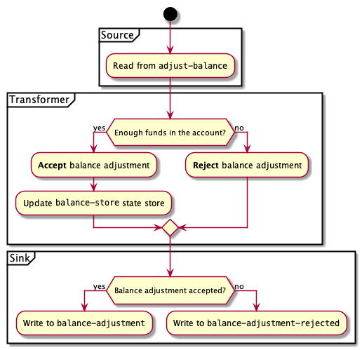

# Kafka Streams example app

Example app to demonstrate Kafka Streams with Kotlin. 


## Kafka Streams Topology

Kafka Streams Topology is configured in [AdjustmentsStreams.kt](src/main/kotlin/tech/nejckorasa/kafka/balances/AdjustmentsStreams.kt), as follows:



1. Source is `adjust-balance` topic.
2. Records flow downstream through a stateful transformer:
    - If account retains positive balance, balance adjustment is **accepted** and balance is persisted in a `balance-store` state store.
    - If account would result in an overdraft, balance adjustment is **rejected**.
3. Stream is materialized to:
    - `balance-adjustment` topic if successful
    - `balance-adjustment-rejected` topic if rejected


> Adjustments Streams App will send a new record to `adjust-balance` topic every second. 

## Topology Tests

Topology is tested in [AdjustmentsStreamTest.kt](src/test/kotlin/tech/nejckorasa/kafka/balances/AdjustmentsStreamTest.kt). No real Kafka broker is used, so the tests execute very quickly with very little overhead.

## Usage

#### Spin up Kafka

Only spin up Kafka components and run Adjustments Streams App outside docker-compose, i.e. you have to start it manually.

Script will also create topics defined in [topics.txt](topics/topics.txt)

```console
$ ./start_kafka.sh
``` 

#### Spin up everything

Spin up everything inside docker-compose:
 - Kafka configured in [docker-compose.yml](docker-compose.yml)
 - Adjustments Streams App configured in [adjustments-streams.yml](adjustments-streams.yml)

```console
$ ./start_all.sh
``` 

#### Stop everything

```console
$ ./stop_all.sh
``` 

#### Follow output topic

Follow `balance-adjustment` / `balance-adjustment-rejected` topic. 

```console
$ ./follow_output_topic.sh

Follow topic balance-adjustment
{"accountId":"3","balance":2950,"adjustedAmount":30}
{"accountId":"2","balance":2530,"adjustedAmount":30}


$ ./follow_output_topic.sh rejected

Follow topic balance-adjustment-rejected
{"accountId":"8","adjustedAmount":-40,"reason":"Insufficient funds"}
{"accountId":"8","adjustedAmount":-50,"reason":"Insufficient funds"}

``` 
